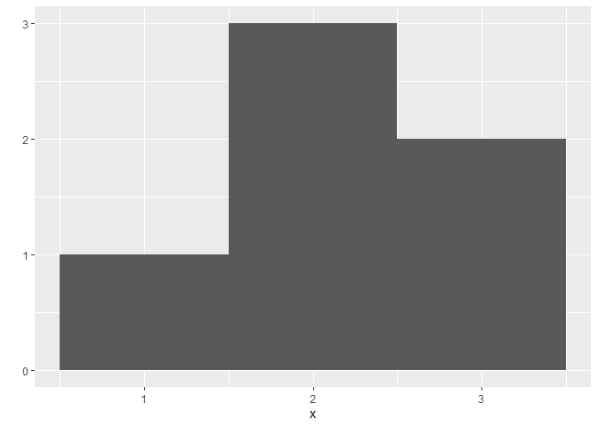

This is a test of Project 1
================

Date: 2022-11-07

Hello! This RMarkdown is for going through the first project of the
book. :)

# R Interface

The numbers before a result tell R what number result starts on that
particular line.

``` r
100:130
```

    ##  [1] 100 101 102 103 104 105 106 107 108 109 110 111 112 113 114 115 116 117 118
    ## [20] 119 120 121 122 123 124 125 126 127 128 129 130

Exercise 2.1, magic with numbers.You’ll get the same number you start
with by following that process.

``` r
827 + 2
```

    ## [1] 829

``` r
829 * 3
```

    ## [1] 2487

``` r
2487 - 6
```

    ## [1] 2481

``` r
2481 / 3
```

    ## [1] 827

# Objects

Create a dice and store it in an object.

``` r
die <- 1:6
```

See what objects are in your environment.

``` r
ls()
```

    ## [1] "die"

R does what is called “element-wise execution” - this means that it does
an operation to each element in a set. Here, we subtract one from each
number on the die.

``` r
die - 1
```

    ## [1] 0 1 2 3 4 5

This is essentially the principle behind tidy data - if you have one
participant in each row, R will perfect operations within that row.

You can get R to do matrix multiplication if you want it to.

``` r
# inner
die %*% die
```

    ##      [,1]
    ## [1,]   91

``` r
# outer
die %o% die
```

    ##      [,1] [,2] [,3] [,4] [,5] [,6]
    ## [1,]    1    2    3    4    5    6
    ## [2,]    2    4    6    8   10   12
    ## [3,]    3    6    9   12   15   18
    ## [4,]    4    8   12   16   20   24
    ## [5,]    5   10   15   20   25   30
    ## [6,]    6   12   18   24   30   36

# Functions

To randomly roll a die, you need to create a function. If you have
multiple functions together, R works by solving the INNER most function
first. In this example, the mean of the die is 3.5 so that is calculated
first. Then that number is rounded to produce 4.

``` r
round(mean(die))
```

    ## [1] 4

We can roll a die through an existing R function, `sample()`.

``` r
sample(x = die, size = 1)
```

    ## [1] 6

Note that the `sample()` function has two arguments, `x` and `size`. To
see how many arguments a function takes, you can execuute this:

``` r
args(sample)
```

    ## function (x, size, replace = FALSE, prob = NULL) 
    ## NULL

``` r
args(round)
```

    ## function (x, digits = 0) 
    ## NULL

Now let’s simulate 2 rolls a die with replacement (the default is
without, meaning you can’t roll snake eyes)

``` r
sample(x = die, size = 2, replace = TRUE)
```

    ## [1] 3 5

# Writing your own functions

Writing a function called `roll()` that simulates rolling virtual dice.
Each time you call it, R will return the sum of rolling two dice.
Otherwise, you’d have to do it this way:

``` r
die <- 1:6
dice <- sample(die, size = 2, replace = TRUE)
sum(dice)
```

    ## [1] 5

3 basic parts: name, body of code, and set of arguments. Let’s put the
above code into a function:

``` r
roll <- function() {
  die <- 1:6
  dice <- sample(die, size = 2, replace = TRUE)
  sum(dice)
}
```

Now let’s run it:

``` r
roll()
```

    ## [1] 10

Typing the function WITHOUT parentheses will give you what is contained
insidie the function:

``` r
roll
```

    ## function() {
    ##   die <- 1:6
    ##   dice <- sample(die, size = 2, replace = TRUE)
    ##   sum(dice)
    ## }

Remember that R will execute ALL of the code int he body and the result
of the LAST line of code. If your function isn’t written in a way where
that will happen, then you won’t get a result.

## Arguments

Now let’s create an argument called `bones` where you can specify
different types of die (1:6 or 1:20), and let’s create that so the
default is 1:6.

``` r
roll2 <- function(bones = 1:6) {
  dice <- sample(bones, size = 2, replace = TRUE)
  sum(dice)
}
```

Now run the default:

``` r
roll2()
```

    ## [1] 5

Now 20-sided dice:

``` r
roll2(bones = 1:20)
```

    ## [1] 5

One thing that’s really cool about this is that writing your own
functions is basically like adding in your own command to a program like
Excel or SPSS.

# Packages and Help Pages

You know how to work with packages so there’s no real need to document
this section :)

Let’s make our first `qplot` (quick plot) with ggplot 2.

``` r
library(ggplot2)

x <- c(-1, -0.8, -0.6, -0.4, -0.2, 0, 0.2, 0.4, 0.6, 0.8, 1)

y <- x^3

qplot(x, y)
```

<!-- -->

Now let’s look at a histogram to inspect one vector (i.e., variable).

``` r
x <- c(1, 2, 2, 2, 3, 3)
qplot(x, binwidth = 1)
```

<!-- -->

And now another one:

``` r
x2 <- c(1, 1, 1, 1, 1, 2, 2, 2, 2, 3, 3, 4)
qplot(x2, binwidth = 1)
```

<!-- -->

Exercise 3.1 (visualize a histogram).

``` r
x3 <- c(0, 1, 1, 2, 2, 2, 3, 3, 4)
qplot(x3, binwidth = 1)
```

<!-- -->

Ok so now we’re going to see how to repeat our dice rolling function
many times. This can be done with the `replicate()` function. Replicate
runs the same command many times and then stores the results as a
vector.

``` r
replicate(3, 1 + 1)
```

    ## [1] 2 2 2

``` r
replicate(10, roll())
```

    ##  [1]  9  3  3  8  9  6  6  6 11 10

Let’s go ahead and simualte 10,000 dice rolls to see what this will look
like.

``` r
rolls <- replicate(10000, roll())
qplot(rolls, binwidth = 1)
```

<!-- -->

This is symmetric, as we’d expect! This is proportional to the odds of
the various combinations of dice. This corresponds with a 1/6
probability of any number getting rolled. What if we increased getting a
6 to 3/8 (and all others to 1/8)?

``` r
roll <- function() {
  die <- 1:6
  dice <- sample(die, size = 2, replace = TRUE, prob = c(1/8, 1/8, 1/8, 1/8, 1/8, 3/8))
  sum(dice)
}
roll()
```

    ## [1] 8

``` r
rolls <- replicate(10000, roll())
qplot(rolls, binwidth = 1)
```

<!-- -->

Et voilà, we created an unfair set of dice here :D
